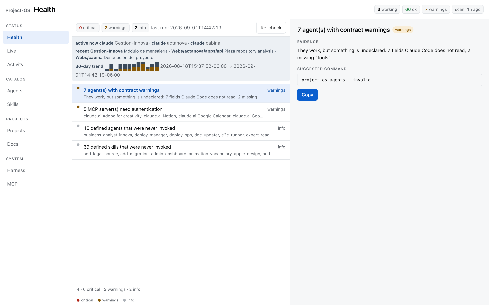
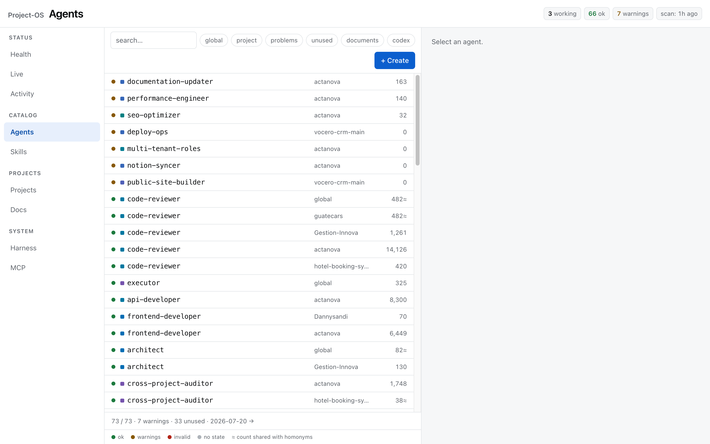

# Project-OS

Package name on PyPI: `project-os`; the command is `project-os`.

A control plane for a [Claude Code](https://claude.com/claude-code) environment: **agents, skills,
harness and docs — across all your projects — under one contract, with a health check that runs on
its own.** Zero dependencies. Local only.

> Project-OS **measures, warns and blocks. It never repairs, deletes or edits anything on its own.**
> Every write goes through a confirmation and a guard. That is the whole design.

## Why

If you run Claude Code across many projects you end up with dozens of agents, hundreds of skills,
hooks that nobody wired, worktrees that nobody removed, and `MEMORY.md` files that stopped being
true a month ago. None of it fails loudly. Project-OS makes it visible — and gives every asset a
contract, a real usage count, and a place in one window.

## Screenshots

The health check with its 30-day trend, evidence pane and generated (never executed) fix command:



The agent roster: contract status, per-project attribution, real usage counts (`≈` marks a count
shared with homonyms — honesty over precision):



## What you get

| Command | What it does |
|---|---|
| `project-os` | Opens the UI in your browser (local server on 127.0.0.1) — nine tabs: Health, Agents, Live, Skills, Projects, Harness, MCP, Docs, Activity |
| `project-os check` | Health check. 9 detectors, exit code 1 on critical. Run it from cron / launchd / a systemd timer |
| `project-os check --repo .` | CI mode: validates one repository's agents against `.project-os.toml` on its own — no user home, no cache |
| `project-os agents` | Agent roster with contract state and real usage. `--invalid`, `--unused`, `--project`, `archive` |
| `project-os scan` | Rebuild the environment cache (fast; `--worktrees` and `--mcp` opt into the slow parts) |
| `project-os fleet` | Terminal TUI over the live provider |
| `project-os config` | Show effective config; `--example` prints a starter `config.toml` |
| `project-os activity` | Session activity read from local transcripts. `--project`, `--days`, `--json` |
| `project-os hub DIR` | Read-only UI over N `project-os export --activity` files dropped in `DIR` — several machines, one view |
| `project-os export` / `project-os compare` | Export this environment as JSON (optionally `--activity`); diff two exports (two machines, or then vs. now) |
| `project-os init` | Print a starter `.project-os.toml` (`--ci` for the GitHub Actions workflow) |
| `project-os mcp` | Read-only MCP server over stdio, so agents can consult the control plane before acting (`--install` for the registration snippets) |
| `project-os hooks` | Print (or `--write`) the `settings.json` entries for the `guard`/`brief` hooks |

### The contract

Every agent must declare four things. Missing `name`/`description` is **critical** (Claude Code
cannot use it); missing `model`/`tools` is a **warning** (it works, but routing and permissions are
undeclared). All of this is configurable.

```yaml
---
name: tax-reviewer          # kebab-case, must equal the filename
description: when to invoke it
model: sonnet               # one of contract.models
tools: Read, Grep           # "*" is allowed — but say it
overrides: global           # only if it shadows a global agent of the same name
---
```

A `.md` in `agents/` **without frontmatter is a document, not an agent** — project-os says so and
does not suggest "fixing" it.

### Real usage, per project

Usage comes from Claude Code's own session history. Each invocation is attributed to the project
whose root contains the session `cwd`, so six agents named `code-reviewer` each get their own count.
Last-use dates are accumulated in `state_dir` so they survive history rotation (~30 days).

> This reads an **undocumented, internal** transcript format. If Claude Code changes it, usage
> degrades to "unknown" — nothing else breaks.

### Session activity

The Activity tab and `project-os activity [--project P] [--days N] [--json]` read the same local
transcripts as usage: per session, turns, tokens, tool calls, files touched, agents/skills
invoked, commits, and duration. Nothing is sent anywhere; it never opens a network connection.

By default this stays on your machine only. `project-os export --activity` shares it: aggregated per
project unless you add `--detail` (per-session rows); `--titles` adds the AI-generated one-line
session title on top, and requires `--detail` (a usage error otherwise, never a silently ignored
flag). Even with every flag on, it never exports the session's `cwd` or absolute file paths — a
path outside the project root is counted, not named.

The Activity tab also shows each session's `entrypoint` (the raw value a transcript carries — `cli`,
`sdk-py`, `sdk-ts`, `sdk-cli`, …) as a filter chip, and a per-session token breakdown (in / cache
read / cache write / out / reasoning, plus a cache-hit rate). Neither `entrypoint` nor reasoning
tokens are exported, sent to `project-os hub`, or served over MCP — session activity there stays at
the older, smaller field set.

### MCP servers, at a glance

`project-os scan --mcp` shells out to `claude mcp list`; the MCP tab (local only, not in
`project-os hub`) shows exactly what it reported — name, target, status, detail — sorted so
anything that needs attention (failed, needs auth, unverified) surfaces first. It does not show
tool counts or which agents use which server: neither is derivable from `claude mcp list`'s output.
(This is a different thing from `project-os mcp`, below, which is project-os acting as an MCP
server *for* your agents.)

### The guards

Project-OS writes in exactly four places, each behind a guard:

- **Create agent** — refused unless it meets the contract.
- **Archive agent / skill** — refused if any file references it (unless you tick "force"). Moves to
  `_archive/<date>/`, never deletes. A symlinked skill is moved as a link; the target is untouched.
- **Edit a document** — refused if the file changed on disk since you opened it (hash check), or if a
  live agent is working in that project. Previous version is backed up; write is atomic. The Docs
  tab has a read-only version history for each document — a diff against the current file, and a
  restore command you review and run yourself; project-os never runs it for you.
- **Open** — hands a path to your OS.

The server defaults to `127.0.0.1`; a configured bind address is accepted only when it is
localhost or a loopback IP (never a LAN address), and every POST needs a per-session token.

### Claude Code and Codex, side by side

If Codex CLI is installed (`~/.codex`), project-os reads its environment too: agents (`*.toml`,
validated against a per-tool contract), skills, `AGENTS.md` per project, and session activity.
Every row carries a `claude` / `codex` chip; `project-os agents --tool codex`.

More useful than seeing both is seeing **where they drift apart**. The same content copied by hand into
two tools diverges silently, so project-os checks:

- **Twin agents** — same name in both tools, different instruction bodies.
- **`CLAUDE.md` ↔ `AGENTS.md`** — per project: `linked` (a symlink, ideal), `copy` (identical today,
  will drift), `bridge` (a short AGENTS.md that points at CLAUDE.md as canonical — deliberate),
  `diverged` (Codex and Claude read different rules here — with the diff).
- **Copied skills** — Codex skills copied from the shared skills dir that no longer match.

`project-os check` reports drift; the Harness tab shows it with the fix (`ln -sf CLAUDE.md AGENTS.md`).

> Codex transcripts record no agent or skill invocations (only shell and MCP calls), so per-agent
> usage for Codex is genuinely not measurable today. Project-OS says so instead of showing zeros as fact.

## Install

```sh
pipx install project-os          # or: pip install project-os
project-os scan                  # first cache (~2 s)
project-os                       # opens http://127.0.0.1:8930
```

Requires Python 3.11+. No other dependencies.

Optional: `git` (project status), `herdr` (Live tab), Codex CLI (its own roster and drift), the
`claude` CLI (only for `project-os scan --mcp`). Everything degrades with a notice; nothing fails.

### Platforms

macOS, Linux and Windows. Claude Code and Codex keep their homes at `~/.claude` and `~/.codex` on
every OS; project-os's own files follow each platform's convention:

| | config | state (cache, usage, doc backups) |
|---|---|---|
| macOS / Linux | `~/.config/project-os/config.toml` (or `$XDG_CONFIG_HOME`) | `~/.local/share/project-os` (or `$XDG_DATA_HOME`) |
| Windows | `%APPDATA%\project-os\config.toml` | `%LOCALAPPDATA%\project-os` |

`grep` and `du` are used when present and replaced by pure-Python equivalents when not (Windows).
`project-os fleet` needs a curses terminal and tells you so where there is none; the web UI works
everywhere. Archiving a **symlinked** skill on Windows needs Developer Mode (symlink privilege) —
project-os refuses cleanly and moves nothing if it cannot recreate the link.

## Configure

`~/.config/project-os/config.toml` (or `$PROJECT_OS_CONFIG`). Everything is optional:

```toml
language = "en"                              # or "es"
roots = ["~/Documents", "~/Desktop"]         # where your projects live
[contract]
models = ["sonnet", "opus", "haiku"]
critical = ["name", "description"]
warn = ["model", "tools"]
[scan]
measure_worktrees = false                    # ~2 s per worktree when on
```

`project-os config --example` prints the full file.

> Known limitation: with `language = "es"`, `project-os --help` and every subcommand's `--help`
> translate their descriptions and flag help text — but `argparse`'s own chrome (`usage:`,
> `positional arguments:`, `options:`, `show this help message and exit`) stays English; it is
> generated by `argparse` itself, not `i18n.py`.

### The doorman: hooks for Claude Code

Two hooks turn project-os from a Monday inspection into a guard at the door:

- **`project-os guard`** (PreToolUse on `Edit|Write|MultiEdit`) — validates the agent file that
  *would result* from the write (for an Edit it reconstructs the file, it does not just look at
  the new string). Contract not met → the write is blocked and Claude sees why. Warnings →
  allowed and surfaced. Anything that is not an agent file → ignored in ~60 ms. If the guard
  itself fails, it allows: a broken guard must never lock you out.
- **`project-os brief`** (SessionStart) — a few lines of context at session start: health, which
  projects have an agent working *right now*, and how stale this project's `MEMORY.md` is.

```sh
project-os hooks            # prints the settings.json entries
project-os hooks --write    # merges them into ~/.claude/settings.json (backup kept, idempotent)
```

### The contract travels with the repo — CI mode

`project-os check --repo .` validates **one repository on its own**: no user home, no cache, no
history. Drop a `.project-os.toml` in the repo root to tune its contract; run it on pull requests
so an agent that breaks the contract cannot be merged.

```sh
project-os init > .project-os.toml          # example contract for this repo
project-os init --ci > .github/workflows/project-os.yml
project-os check --repo .               # exit 1 on invalid agents ([check] strict = true: warnings too)
```

### Two machines, one picture

```sh
project-os export -o mac.json           # on the Mac
project-os export -o win.json           # on the Windows box
project-os compare mac.json win.json    # agents/skills/projects only on one side; agents whose state differs
```

### Hub — several machines, one read-only view

`compare` is a one-shot diff of two files. `project-os hub` is a live view over as many as you like:

```sh
project-os export --activity -o mac.json      # on each machine
project-os hub ~/shared/project-os-exports/   # point it at a folder with those files copied in
```

It serves the same UI over the merged exports — agent/project/harness rows carry a machine chip
and are keyed by name **and** machine, so two machines with a same-named project or agent do not
collide. It is read-only by design: no Live tab, no Docs tab, no create/archive/rescan/commit
buttons — there is nothing in `hub` for any of those to write to.

### Committing what project-os changed (opt-in)

When project-os archives an agent or skill, or saves a document at your request, the dialog
offers *"and commit this change"*. It commits **only that path** (`git add -A -- <path>`, then
`git commit -- <path>`), never `-A`, never automatically, and refuses mid-merge/rebase. Other
files you or an agent had staged are left exactly as they were.

### Let the agents ask — MCP server (read-only)

`project-os mcp` is an MCP server over stdio. Registered in Claude Code and/or Codex, the agents
themselves can consult the control plane **before** acting:

| tool | question it answers |
|---|---|
| `project_os_working` | is any agent working in project X right now? (ask before touching `MEMORY.md`) |
| `project_os_agent` / `project_os_agents` | does this agent meet the contract? where does it exist? how much is it used? |
| `project_os_references` | who references Y? (ask before archiving or renaming) |
| `project_os_project` | branch, uncommitted changes, harness level, dead hooks, memory age |
| `project_os_health` / `project_os_drift` | the same findings `project-os check` reports |

Every tool is read-only; the server has no write path at all.

```sh
project-os mcp --install                        # prints both registrations:
claude mcp add project-os -s user -- project-os mcp
# ~/.codex/config.toml
[mcp_servers.project-os]
command = "project-os"
args = ["mcp"]
```

### Run the health check on a schedule

```sh
# cron (Linux/macOS): Mondays 09:00, desktop notification if anything to see
0 9 * * 1  project-os check --notify >> ~/.local/share/project-os/check.log 2>&1
```

## Development

```sh
git clone … && cd project-os
python -m unittest discover -s tests -v      # the full suite, stdlib only
PYTHONPATH=src python -m project_os check
```

`tests/test_breaks.py` removes each guard in memory and asserts the canary tests go red — so a
guard cannot be silently deleted later.

## Non-goals

- It will not delete worktrees, repair agents, or auto-archive anything. It tells you the exact
  command and lets you run it.
- It is not an LLM observability tool (traces, cost per call). Look at Langfuse/LangSmith for that.
- It is not Backstage. It is the foreman's notebook, not the HR building.

## License

MIT
